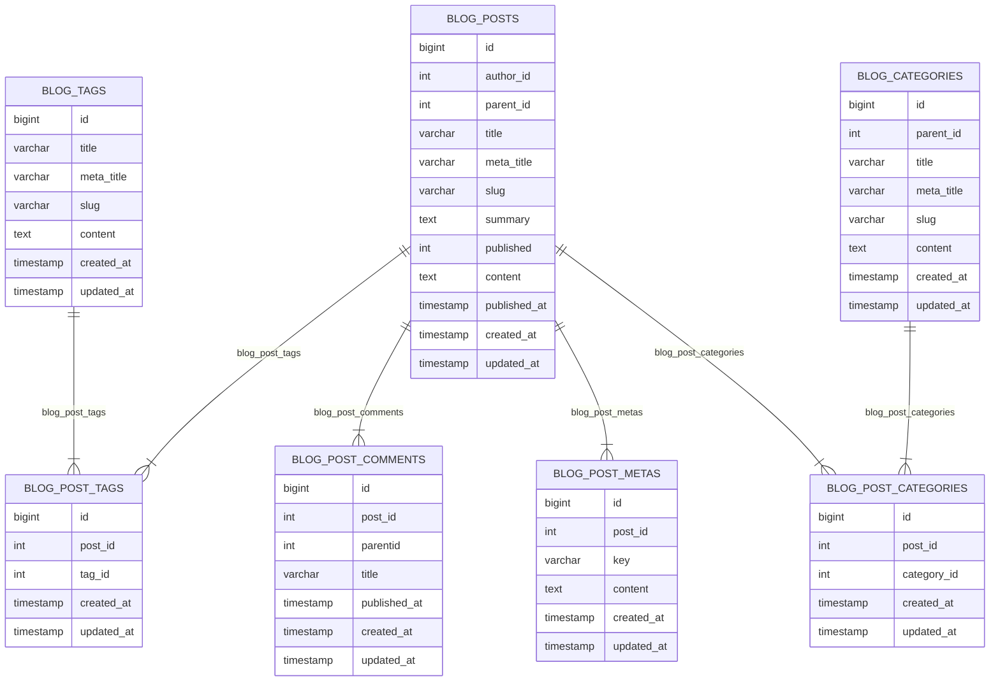

```mermaid
erDiagram
    BLOG_POSTS ||--|{ BLOG_POST_TAGS : blog_post_tags
    BLOG_POSTS {
        bigint id
        int author_id
        int parent_id
        varchar title
        varchar meta_title
        varchar slug
        text summary
        int published
        text content
        timestamp published_at
        timestamp created_at
        timestamp updated_at
    }
    BLOG_CATEGORIES ||--|{ BLOG_POST_CATEGORIES : blog_post_categories
    BLOG_CATEGORIES {
        bigint id
        int parent_id
        varchar title
        varchar meta_title
        varchar slug
        text content
        timestamp created_at
        timestamp updated_at
    }
    BLOG_TAGS ||--|{ BLOG_POST_TAGS : blog_post_tags
    BLOG_POST_TAGS {
        bigint id
        int post_id
        int tag_id
        timestamp created_at
        timestamp updated_at
    }
    BLOG_TAGS {
        bigint id
        varchar title
        varchar meta_title
        varchar slug
        text content
        timestamp created_at
        timestamp updated_at
    }
    BLOG_POSTS ||--|{ BLOG_POST_COMMENTS : blog_post_comments
    BLOG_POST_COMMENTS {
        bigint id
        int post_id
        int parentid
        varchar title
        timestamp published_at
        timestamp created_at
        timestamp updated_at
    }
    BLOG_POSTS ||--|{ BLOG_POST_METAS : blog_post_metas
    BLOG_POST_METAS {
        bigint id
        int post_id
        varchar key
        text content
        timestamp created_at
        timestamp updated_at
    }
    BLOG_POSTS ||--|{ BLOG_POST_CATEGORIES : blog_post_categories
    BLOG_POST_CATEGORIES {
        bigint id
        int post_id
        int category_id
        timestamp created_at
        timestamp updated_at
    }
```